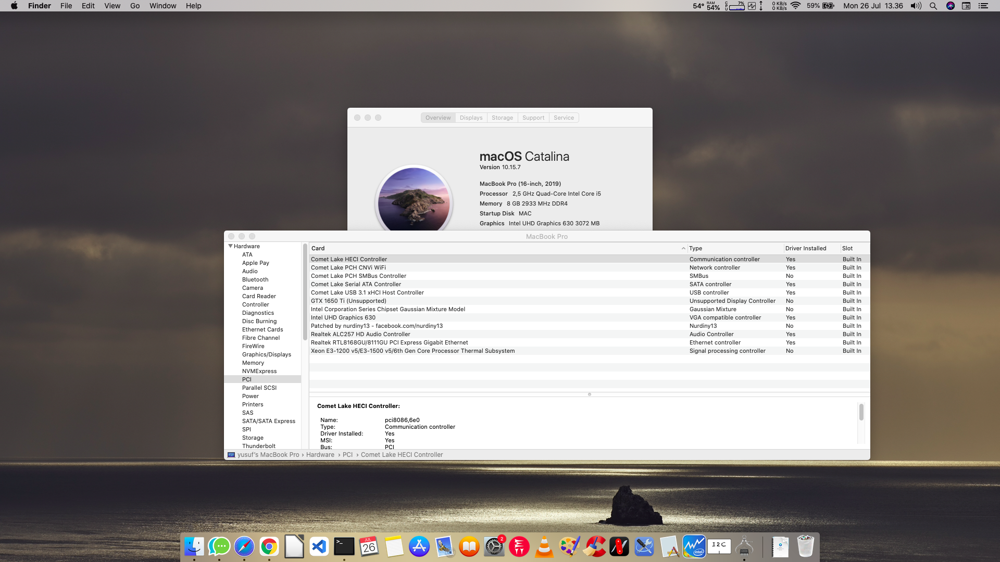

# Lenovo IdeaPad Gaming 3i Hackintosh
Opencore 0.7.0
# Laptop Hardware

- <b>CPU</b>: [Intel i5 10300H](https://ark.intel.com/content/www/us/en/ark/products/201839/intel-core-i5-10300h-processor-8m-cache-up-to-4-50-ghz.html) Quad-Core CPU (Comet Lake)
- <b>IGPU</b>: Intel UHD 630 Graphics 
- <b>DGPU</b>: GTX 1650 Ti
- <b>Storage</b>: SSD 512 Team sata ngff with converter to sata
- <b>RAM</b>: 1x8 DDR4 2933
- <b>Screen</b>: 15.6-inch IPS Full HD (1920 x 1080)
- <b>Trackpad</b>: MSFT0001 (I2C)
- <b>Wi-Fi</b>: AX 201
- <b>Ports</b>: 1 x USB-C, 1 x USB 3.0, USB 2.0 , HDMI Display Port, Ethernet Port

# What's Working?
- Intel HD 630 Graphics full QE/CI 
- CPU power management 
- Conservation Mode
- Battery
- All USB ports 
- Realtek Ethernet port 
- Realtek ALC256 Audio (including headphones jack)
- Bluetooth
- Wi-Fi 
- Internal webcam with Facetime
- MSFT0001 Trackpad (full gestures)
- Sleep
- Screen Brightness
- Brightness Key
- Fn keys
- macOS Catalina 10.15

# What's Not Working?
- GTX 1650 Ti
- HDMI

# Misc
- You can enable/disable Conservation Mode in Windows or ubuntu

# Touchpad Issue
- go to device manager > Human interface device > hid compilant touchpad > properties > details tab > property > hardware ids.

if you find the values are the same as mine (according to the screenshot) there should be no problem with your touchpad, but if it's different then I'm sure it won't work.
